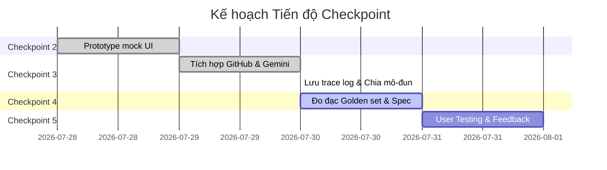

# Nhật ký Tiến độ dự án - LabSplitter (Nhóm Vincenzo - E403)

Tài liệu này ghi nhận tiến độ thực tế qua các Checkpoint của dự án LabSplitter (Trợ lý tự động chia việc nhóm từ tài liệu Github).

---

## 🎯 Mục tiêu hiện tại: Checkpoint 3 (AI Running + Initial Measurements)

### 1. Nhiệm vụ ĐÃ HOÀN THÀNH (Done)
- [x] **Xây dựng Prototype thô (Checkpoint 2)**:
  - [x] Dựng khung giao diện Web UI (HTML/CSS) cơ bản gồm 4 màn hình bấm đi hết luồng chính.
  - [x] Thiết lập dữ liệu Mock ban đầu cho vai trò và tiến độ.
- [x] **Tích hợp Công cụ GitHub**:
  - [x] Tích hợp bộ đọc link GitHub tự động tải file README của dự án.
  - [x] Xây dựng cơ chế fallback mở khung nhập tài liệu (textarea) dự phòng khi gặp lỗi private/404.
- [x] **Tích hợp AI và chia việc động**:
  - [x] Kết nối thành công AI Gemini (`gemini-3.5-flash`) thông qua REST API.
  - [x] Hỗ trợ truyền tham số `num_members` để AI sinh ra CHÍNH XÁC đúng số lượng vai trò mong muốn.
  - [x] Tạo giao kèo dữ liệu (Data Contract) định dạng JSON cụ thể giữa các task có sự trao đổi thông tin.
- [x] **Lưu vết và Trace Log (Yêu cầu CP3)**:
  - [x] Tự động ghi lại các trace log chi tiết (thời gian chạy, prompt đầu vào, JSON thô từ API, kết quả parse) vào thư mục `eval/traces/` mỗi khi có lượt gọi AI thành công để phục vụ đo đạc ban đầu.
- [x] **Tái cấu trúc mã nguồn (Refactoring)**:
  - [x] Phân rã mã nguồn đơn khối từ `codebase/app.py` thành gói mô-đun hóa `starter_v0/app/`.
  - [x] Tạo runner `starter_v0/app.py` chạy ổn định và sạch sẽ.
  - [x] Viết bộ kiểm thử tự động `starter_v0/test_app.py` kiểm chứng toàn bộ luồng tích hợp (Pass 100%).
  - [x] Xóa bỏ code cũ `codebase/` để làm sạch workspace.

---

## 📈 Trạng thái các Checkpoint tiếp theo

### 2. Nhiệm vụ ĐANG THỰC HIỆN & TIẾP THEO (To Do)
- [ ] **Checkpoint 4 (Automation & Quality Bar)**:
  - [ ] Thiết lập file Golden Set gồm 20 bài lab thực tế khác nhau để đo lường tự động.
  - [ ] Viết script chạy đo lường tỷ lệ phân chia đúng số vai trò và tỷ lệ sinh data contract thành công.
  - [ ] Hoàn thiện Spec đầy đủ với các kịch bản rủi ro chi tiết.
- [ ] **Checkpoint 5 (User Validation)**:
  - [ ] Demo và xin ý kiến phản hồi (Feedback) từ ít nhất 5 học viên ngoài nhóm.
  - [ ] Ghi chép quote phỏng vấn nguyên văn và cập nhật Changelog dựa trên góp ý của học viên.
